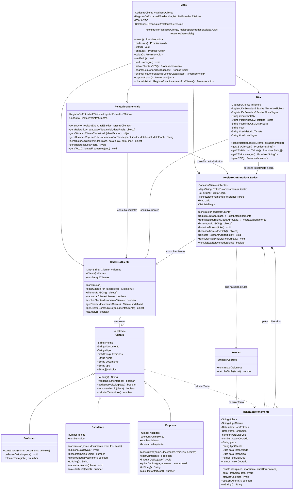

# Diagrama de Classes

Diagrama de classes fiel ao estado atual do código da aplicação.

## Observações

- O diagrama representa apenas classes reais do código atual. `app.js` foi omitido porque faz a orquestração via funções, não por classe.
- `Avulso` não herda de `Cliente`; ele é um tipo independente usado pontualmente em `RegistroDeEntradasESaidas`.
- `TicketEstacionamento` não mantém referência direta a `Cliente`; ele guarda apenas `tipoCliente` e os dados da estadia.
- `RegistroDeEntradasESaidas` mantém a `listaNegra` como `Set<String>`, então a relação foi representada como estado interno, não como classe separada.
- `RelatoriosGerenciais.geraRelatorioListaNegra()` e `geraTop10ClientesFrequentes()` existem no código, mas ainda estão sem implementação.
- Em `Menu.cadastrar()`, o código atual chama `this.#cadastroCliente(cliente)`, embora a modelagem da aplicação indique uso de `cadastrarCliente(cliente)`.
