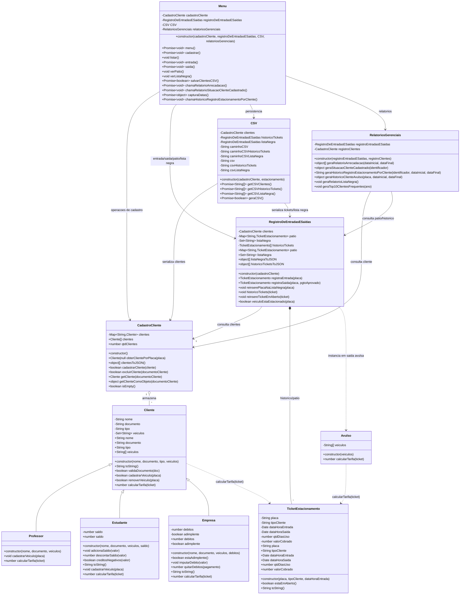

# Diagrama de Classes

Diagrama fiel ao estado atual do código em `src/entities` e ao bootstrap em `app.js`.

## Observações de fidelidade

- `Avulso` não herda de `Cliente`; ele só é instanciado por `RegistroDeEntradasESaidas` para calcular tarifa de saída avulsa.
- A lista negra não é modelada como coleção de clientes. No código, ela é um `Set<String>` de placas dentro de `RegistroDeEntradasESaidas`.
- O bootstrap em `app.js` instancia `CadastroCliente`, `RegistroDeEntradasESaidas`, `CSV`, `RelatoriosGerenciais` e `Menu`, depois reidrata clientes, tickets e lista negra a partir dos CSVs.
- `TicketEstacionamento` calcula `qtdDiasUso` internamente ao definir `dataHoraSaida`.
- `RelatoriosGerenciais` possui dois métodos ainda sem implementação: `geraRelatorioListaNegra()` e `geraTop10ClientesFrequentes(ano)`.

## Referências principais

- [app.js](/home/luan/Projects/projeto-fase1-POO/app.js)
- [Cliente.js](/home/luan/Projects/projeto-fase1-POO/src/entities/cliente/Cliente.js)
- [Professor.js](/home/luan/Projects/projeto-fase1-POO/src/entities/cliente/Professor.js)
- [Estudante.js](/home/luan/Projects/projeto-fase1-POO/src/entities/cliente/Estudante.js)
- [Empresa.js](/home/luan/Projects/projeto-fase1-POO/src/entities/cliente/Empresa.js)
- [Avulso.js](/home/luan/Projects/projeto-fase1-POO/src/entities/cliente/Avulso.js)
- [CadastroCliente.js](/home/luan/Projects/projeto-fase1-POO/src/entities/cliente/CadastroCliente.js)
- [TicketEstacionamento.js](/home/luan/Projects/projeto-fase1-POO/src/entities/estacionamento/TicketEstacionamento.js)
- [RegistroDeEntradasESaidas.js](/home/luan/Projects/projeto-fase1-POO/src/entities/estacionamento/RegistroDeEntradasESaidas.js)
- [CSV.js](/home/luan/Projects/projeto-fase1-POO/src/entities/csv/CSV.js)
- [RelatoriosGerenciais.js](/home/luan/Projects/projeto-fase1-POO/src/entities/relatorio/RelatoriosGerenciais.js)
- [Menu.js](/home/luan/Projects/projeto-fase1-POO/src/entities/menu/Menu.js)
